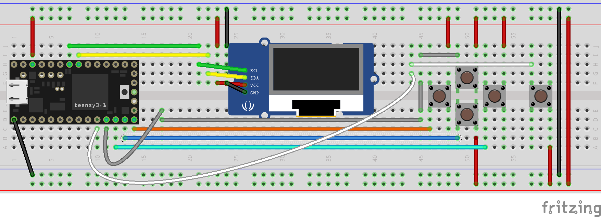
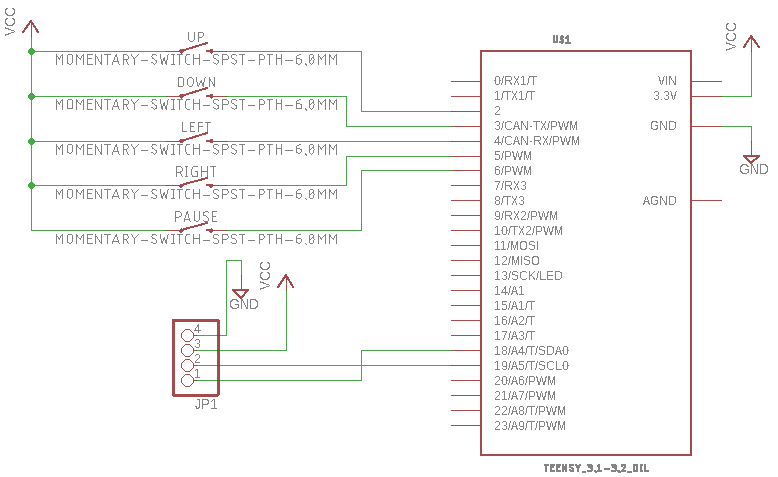
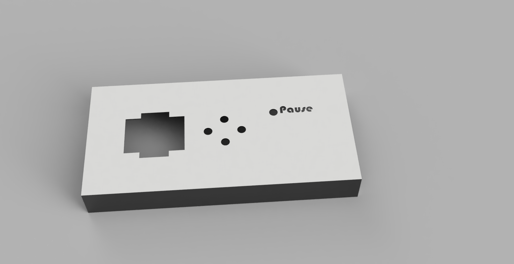
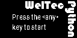
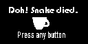

# weltec-snake
**WelTec: Embedded Systems: Project 2: Finite State Machine**

This project is an adaptation of the old 'Snake' game on a small OLED display running off a Teensy. You control the WelTec Python on its quest to drink as much coffee as possible. Each level represents one of the WelTec buildings and the aim is to drink all of the coffee in all of the buildings. 

## Usage
To run this project, build the circuitry shown below and power it via USB. The software was written using the Arduino framework on VS Code with the PlatformIO extension. 

You will need to make a couple of minor changes to the libraries that get downloaded by Platform IO:

* Adafruit_SSD1306.h - find `#define SSD1306_128_64` and uncomment it and comment out the other two around it. This selects the correct display size.
* Adafruit_SSD1306.cpp - replace `#include <Wire.h>` with `#include <i2c_t3.h>`. This is required to enable some additional features on the Teensy - speeding up the IC2 interface.

The easiest way to upload it to the Teensy is to open the `software` folder in VS Code and hit the upload button on Platform IO once the Teensy is plugged in via USB.

### Folder structure
The following file and folder structure has been used in this repository:

* datasheets - Relevant datasheets for this project
* electronics - The EAGLE and Fritzing schematics and image exports
* software - The microcontroller code as a PlatformIO project.
* hardware - The CAD model 3D printer files for the physical casing
* media - Images for the README and those used in creating the game graphics
* README.md - This file
* LICENSE - The re-use and re-distribution license

### Dependencies
All dependencies are defined in the platformio.ini file and are managed by Platform IO. No external dependencies exist.

## Requirements
Develop an embedded system based game of your choice, including the following components and design paradigms:

1. Application logic is based on a Finite State Machine (enum + switch... case...)
2. All components listed below are an integral part of your system (you can use more):
    * Buttons as needed
    * Teensy 3.2
    * Resistors as needed
    * Breadboard + Jumper Wires
    * 128x64 OLED Display SSD1306: I<sup>2</sup>C-Version

Additional more detailed requirements:

3. Implement a start-, pause-, end-screen and the actual game
4. Display a player score (game-screen and end-screen)
5. Implement debouncing of your button(s)
6. Design and Implementation as a state-machine
7. Feel free to use the Adafruit libraries: Adafruit_SSD1306 and Adafruit_GFX
8. Follow a systematic design process

## Design / Architecture

### Electronics

The breadboard design can be seen below:



The schematic for this setup is simple and can be seen below:



### Software
The core game loop executes a finite state machine. The states are encoded in the `GameState` enum and are:
* MainMenu
* Playing
* Paused
* Died
* WonLevel
* WonGame

The state transition diagram for this can be seen below:


The game structure is a simple grid where each square has a state based on what the square contains. This could be Empty, Wall, Coffee or Snake. The collision logic simply determines whether the currentely occupied square for the head of the snake corresponds to a grid square state that is Wall or Snake and if so the player loses the game.

The snake itself is stored as a linked list data structure. Every move adds a new head location to the linked list. If the player doesn't consume a coffee on the current move then the snake tail is removed from the linked list. This provides the appearance of locamotion to the snake.

Levels are defined as 2-dimensional character arrays and then parsed into the game grid structure at run-time. This makes it much easier to create levels. N-Block, for example, is defined as follows:

```c++
const char* N_BLOCK_LEVEL_MAP[] = {
  "WWWWWWWWWWWWWWWWWWWWWWWWWWWWWWWWWWWWWWWWWWWWWWWWWWWWWWWWWWWWWWWW",
  "WWWWWWW      W                             W               WWWWW",
  "WWWWWWW      W     WWWWW  WW   WW  WW      W               WWWWW",
  "WWWWWWW      W     WWWWW           WW      W               WWWWW",
  "WWWWWWW      W            WW   WW  WW   WW W               WWWWW",
  "WWWWWWW      W WW         WW                               WWWWW",
  "WWWWWWW      W            WW   WW  WW   WW                 WWWWW",
  "WWWWWWW      W     WWWWW  WW   WW  WW                      WWWWW",
  "WWWWWWW      W                          WW W               WWWWW",
  "WWWWWWW      W                             W               WWWWW",
  "WWWWWWW      WWWWWWWWWWWWWWWWWW   WWW   WWWWWWWWWWWWWWWWWWWWWWWW",
  "WWWWWWW               W             W   W                WWWWWWW",
  "WWWWWWW               W             W   W                WWWWWWW",
  "WWWWWWW               W             W   W                WWWWWWW",
  "WWWWWWW               W             W   W                WWWWWWW",
  "WWWWWWW        WWWWWWWWWWWWWWWWWWWWWW   W                WWWWWWW",
  "WWWWWWW        W         W          W   W                WWWWWWW",
  "WWWWWWW        W         W              W                WWWWWWW",
  "WWWWWWW        W         W              W                WWWWWWW",
  "WWWWWWW        W         W          W   W                WWWWWWW",
  "WWWWWWW        WWW  WWWWWWWWWWWWWWWWW   W                WWWWWWW",
  "WWWWWWW                                 W                WWWWWWW",
  "WWWWWWW                                 W                WWWWWWW",
  "WWWWWWWWWWWWWWWW  WWWWWWW  WWWWWWWWWW   W      WWWWWWWWWWWWWWWWW",
  "WWWWWWW              W              W   W      W         WWWWWWW",
  "WWWWWWW              W              W   WWWWWWWW         WWWWWWW",
  "WWWWWWW              W              W          W         WWWWWWW",
  "WWWWWWW              W              W 0 WWWW             WWWWWWW",
  "WWWWWWW              W              W 1 WWWW             WWWWWWW",
  "WWWWWWWWWWWWWWWWWWWWWWWWWWWWWWWWWWWWWWWWWWWWWWWWWWWWWWWWWWWWWWWW"
};
```

Game menus were created as monochrome BitMaps in Paint and then converted into C byte arrays using an online tool, http://javl.github.io/image2cpp/.

### Hardware

The hardware is designed to be very easy to create. The components are off-the-shelf buttons and a small display. The only hardware created for this project is a simple 3D printed plastic overlay. The buttons used don't stay on breadboard particularly well so the plastic case was designed to keep them in place. It also conveniently serves to encase the buttons and display and hide the wiring.

The design was created in AutoDesk Fusion 360 and the archive file is available in the `hardware` directory. The final design looks like the image below:



## Implementation
Overall the implementation was relatively trivial. The small number of problems encountered are outlined in detail below.

### Components / BoM
| Supplier | Supplier Part # | # | Description                 | MNF Part #    |
|:---------|:---------------:|---|:----------------------------|:--------------|
|          |                 | 1 | Teensy 3.2                  |               |
|          |                 | 1 | SSD1306 128x64 OLED Display |               |
|          |                 | 5 | Momentary touch Button      |               |

Eagle component libraries for some of these components were sourced as follows:
* Teensy - https://forum.pjrc.com/threads/24006-Eagle-library-for-MK20DX128VLH5?p=71944&viewfull=1#post71944
* Push button - https://github.com/sparkfun/SparkFun-Eagle-Libraries/blob/master/SparkFun-Switches.lbr

### Software
A 3rd party LinkedList implementation was used. It can be found on GitHub at https://github.com/ivanseidel/LinkedList. It was included as a dependency using PlatformIO's library management mechanism.

A library change had to be made to get it to work with the OLED display supplied. Specifically, in Adafruit_SSD1306.h, the appropriate display size had to be selected and the others commented out. The correct one was `#define SSD1306_128_64`.

By default the I<sup>2</sup>C bus speed is fairly slow for graphics. To improve on this, in Adafruit_SSD1306.cpp, the `Wire` library include was replaced with `#include <i2c_t3.h>` to make additional Teensy specific I<sup>2</sup>C functions available. These were then used in `GfxEngine::begin()` as follows:

```c++
Wire.setClock(1800000);
Wire.setOpMode(I2C_OP_MODE_DMA);
```

This sets the bus clock speed to 1.8Mhz and uses Direct Memory Access to communicate rather than waiting on interrupts.

In addition, the `platformio.ini` file was updated to include `board_build.f_cpu = 96000000`. This overclocks the Teensy CPU to 96Mhz. Although technically it is possible to overclock the Teensy to 120Mhz, the OLED display can't handle communication at higher rates than 1.8Mhz. See the Electronics implementation details for more discussion on this topic.

### Electronics
The I<sup>2</sup>C address for the OLED display was pre-determined using some scanning code (https://playground.arduino.cc/Main/I2cScanner) as 0x3C.

To try and improve the frame rate on the OLED display, the CPU frequency (and I<sup>2</sup>C bus speed) on the Teensy were increased in software. It was discovered however that we were limited to a 96Mhz CPU speed because the clock signal for the OLED display couldn't switch fast enough to cope above that. It was believed that this is because the pull-up resistors internal to the OLED display are too large to allow the clock signal to rise fast enough. Smaller resistors would result in more power wasted but since this isn't a concern in our case it was worth trying. However, although placing small external resistors in parallel to them does appear to improve the shape of the clock signal (much more square wave than shark tooth), thus in theory enabling faster clock speeds, the voltage level of the clock signal is half the expected voltage. In short, it doesn't help and the display doesn't seem to work above a 1.8Mhz bus speed.

### Hardware
The Fusion 360 body was exported as STL and sliced to G-code for 3D printing. Both the STL and the G-code file can also be found in the `hardware` directory. Some features of the design required a 0.1mm precision which required the design had to be sliced quite finely (at 0.1mm) to put together the G-code. Although it would have been preferable from a finished product quality standpoint to slice it at half that (0.05mm), the 3D printer used for the print couldn't achieve that level of precision. The final printed overlay can be seen in the image below:


## Testing

Requirements based testing was conducted as follows:

1. **Passed**: the enum / switch / case based Finite State Machine is implemented in the main `void loop()` function in `main.cpp`.
2. **Passed**: The required components are all integral parts of the game.
3. **Passed**: Start, Pause, End-screen and actual game are all implemented. The screens themselves can be seen below:

  


## Conclusions

## References

* https://github.com/ivanseidel/LinkedList
* https://www.weltec.ac.nz/assets/Uploads/Petone-campus-map-and-transport-info.pdf